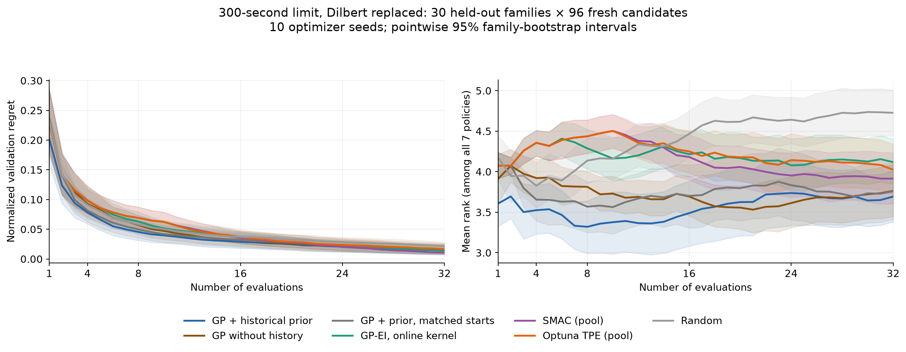

# XGBoost HPO prior

A compact historical prior for **sequential ask/tell hyperparameter optimization**. Two XGBoost models predict the mean and scale of configuration quality; a learned Matérn kernel supplies correlations. The optimizer uses two prior Thompson proposals, then Gaussian-process expected improvement on normal-rank losses.

This repository contains the data and recipe for reproducing the prior. The experimental optimizer implementation lives on [RAMitchell/xgboost, branch `codex/hpo-ask-tell`](https://github.com/RAMitchell/xgboost/tree/codex/hpo-ask-tell). It is not part of a released XGBoost API. There is no training wrapper or automatic download.

## Reproduce the prior

Use Python 3.12 or newer:

```bash
git clone https://github.com/RAMitchell/xgboost-hpo.git
cd xgboost-hpo
python -m venv .venv
source .venv/bin/activate
pip install -r requirements.txt
python verify.py
python train_prior.py --output build/prior
```

This trains **two small prior models**, then fits the historical kernel. It does not retrain the 2,000 underlying dataset/configuration evaluations and does not access OpenML. Existing output directories are rejected; the frozen `prior/` files are never overwritten. Training uses one CPU thread.

`prior/` contains the evaluated historical artifact: `mean.ubj`, `scale.ubj`, `model.json`, and a versioned checksum manifest. `build/prior/` is a compatible newly trained artifact. Small numerical changes can affect decisions; exact reproduction requires the historical numerical environment. Dependencies in `requirements.txt` define a compatible environment, not a claim of bitwise identity.

The original library reported XGBoost 3.5.0-dev, SHA-256 `b37cfda4bc173750622ae62c4731588fa206dd055ab47ea26bcf2582becdf089`; its exact build ancestry was not independently verified. The original fitting environment used NumPy 2.5.0 and SciPy 1.18.0. The reproduction script records the actual XGBoost version and library hash. The data and frozen artifact remain useful without reproducing that binary.

## Use with the implementation branch

```python
import json
from xgboost import hpo

candidates = json.load(open("candidates.json"))
prior = hpo.Prior.load("prior", candidates=candidates)
optimizer = hpo.Optimizer(candidates, prior=prior, random_state=42)

for _ in range(32):
    trial = optimizer.ask()
    loss = evaluate(trial.params)  # Your training, validation and metric.
    optimizer.tell(trial, loss)

optimizer.save("optimizer.json")
```

The example's `evaluate` is caller-supplied. Report failures using `optimizer.tell(trial, status="failed", message="reason")`; failed candidates are excluded without fabricated losses. Use `hpo.Optimizer.load(...)` to resume. See the branch's Python documentation for the full interface and supported parameter encoding.

## Data and scope

- **50 OpenML source datasets × 40 shared configurations**: 1,999 successes and one retained failure. `data/evaluations.parquet` stores the raw validation losses and status. No test losses enter prior fitting.
- `configurations.json` stores the 40 source configurations; `candidates.json` is the separate 96-configuration pool used in the benchmark. `space.json` defines ranges and conditional restrictions.
- `datasets.json` records OpenML IDs/versions, source metadata, task types and reported licenses. `splits/` contains original source-row indices. No raw feature tables are redistributed.
- Workloads are small/medium tabular problems, capped at 20,000 rows and approximately four million cells. CPU histogram training, unweighted classification log loss or regression RMSE, 2,000-round ceiling, 100-round early stopping patience. Original collection had a 120 CPU-second guard; later benchmark used 300 seconds.
- The prior accepts only its documented parameter ranges. It was not validated for class-weighted training, other objectives, unrestricted sizes or arbitrary parameter expansions. Users own training weights and metric selection. Rank normalization does not erase changes in the training regime.

## Evidence

[Benchmark results](benchmark/RESULTS.md) compare the historical-prior GP with prior-free and online-kernel GPs, SMAC, Optuna TPE and random search on 30 source-disjoint dataset families. [Interpretation and limitations](benchmark/INTERPRETATION.md) accompany regret-versus-budget and rank-versus-budget plots. All curves use validation losses, not test performance.



`benchmark/replay.py` verifies the implementation's historical-prior decisions against all 300 archived GP runs without objective training. `benchmark/plot.py` reconstructs mean regret/rank curves from the stored trajectories. Other optimizers' trajectories are frozen evidence. This compact repository reproduces the prior and GP decision replay; it does not include the full exploratory-study runners.

The held-out datasets had been inspected during research. Replacing an expensive dataset was post-hoc. These are conditional research results, not an untouched confirmation or a claim of universal superiority. The default branch intentionally contains one prior recipe and one benchmark, not every exploratory study.

## Repository history and license

The repository starts from this compact snapshot. Obsolete training curves and research artifacts were removed from published Git history; there is no archive tag or release attachment. The compact evaluation records, OpenML metadata, source splits, prior-fitting code and benchmark evidence remain. An ordinary clone downloads only this small history. Existing clones of the old research history should be replaced with a fresh clone for further work; do not merge or force-push their old history back.

Code is Apache-2.0. Source datasets retain their own licenses; the repository license does not relicense third-party data or derived records. Consult the dataset metadata and source terms. OpenML's generic “Public” label is not a license grant.
