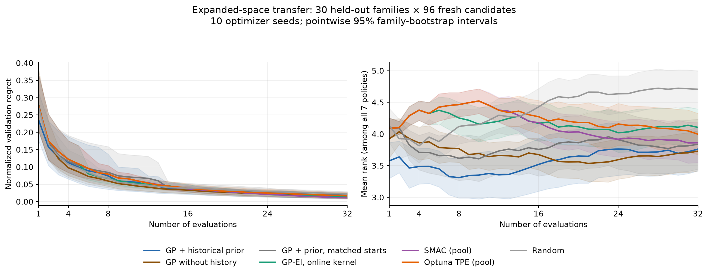

# Expanded-space historical prior and held-out comparison

This study learns a prior from the initial 50-family collection and compares the resulting GP with common alternatives on separate families and fresh configurations. Read [PROTOCOL.md](PROTOCOL.md) before running anything. The frozen prior is in `prior/`; the source dataset records are not modified.

The candidate pool contains 96 IID configurations in the same expanded search space, with no exact overlap with the 40 source configurations. Targets are drawn from the previously reserved 59 families. Up to 30 are admitted under the recorded size/availability criteria. Ten optimizer seeds are replayed to budget32 on the same collected objective table. The table can support later additional optimizer comparisons without retraining XGBoost objectives.

## Results

[Results table](reports/RESULTS.md) · [Interpretation and limitations](reports/INTERPRETATION.md)



## Study entry points

Install the root requirements and this directory's `requirements.txt`. For exact objective reproduction the original snapshotted XGBoost library is required; see the root reproduction caveat. The package versions, library hash, protocol, source inputs, policy/collection code and prior are recorded in `environment.json` and `freeze.json`.

From the repository root:

```bash
python studies/expanded-prior-v1/checks.py
python studies/expanded-prior-v1/prior_api.py
python studies/expanded-prior-v1/collect.py
python studies/expanded-prior-v1/replay.py
python studies/expanded-prior-v1/report.py
```

The collection command downloads/prepares target datasets and can launch up to16objective workers, using the frozen physical CPU IDs in design.json. The hardware-specific execution setup is deliberately explicit; on another machine create a versioned protocol/run instead of changing this freeze silently. Raw outputs live under `runs/expanded-prior-v1/`, excluded from Git. `collect.py` reuses existing per-fit records. Create `runs/expanded-prior-v1/STOP` to stop dispatch and request termination at an iteration boundary. No additional variants are automatically launched.

`fit_prior.py` documents fitting from source outcomes. The shipped prior makes refitting unnecessary; the script reuses it when already present. To change the source/design, create a separate versioned study. `freeze.py` is the one-time design-freezing operation, not a command to run on the already-frozen study.

`report.py` implements the predeclared statistics and plots. It and export/interface helpers were added while collection ran, before reviewing target performance; they are outside the original policy/collection freeze. A final artifact manifest records their versions. No optimizer choice was changed using target results.

## Reusing the learned prior

`prior_api.predict_prior(configurations)` loads the two fitted XGBoost models and historical ARD kernel, returning a mean vector, latent covariance matrix, and observation-noise variance for the requested legal pool. It reproduces `prior/candidate_prior.npz` exactly on the evaluation pool. Pass these arrays into `QuantileGP` from `examples/quantile_gp_numpy.py`.

The prior only supports the archived parameter ranges and growth/column-sampling design. It consumes configurations, not dataset meta-features. An XGBoost installation is required to evaluate its mean/scale models; the online GP itself uses NumPy. There is no portfolio initializer: the first two GP proposals are prior Thompson samples.

## Baseline interpretation

SMAC and Optuna TPE use their installed model/density/acquisition components but search the identical fixed pool. This controls expensive evaluations and makes replay reproducible. It is not a claim about package performance in unrestricted continuous spaces. Startup counts and matched-start diagnostics are explicit in the protocol. The GP-EI comparator fits its kernel using only current-task observations; the learned prior is fitted only on source families.

## Reproduce the exact published target roster

The collection controller replays admission and may encounter different network failures. Once the target snapshot is exported, use the generic reproduction command to fix both the admitted roster and exact source-row splits:

```bash
python scripts/reproduce.py --snapshot data/heldout-expanded-v1 --all --workers 16 --output runs/heldout-reproduction
```

Add `--prepare-only` to download/reconstruct without training; replace `--all` with `--dataset-id ID --config-id eval_000` for a small check. Replaying optimizer decisions from the published objective table does not require these trainings.

## Replay without training objective models

```bash
python studies/expanded-prior-v1/verify_artifacts.py
python studies/expanded-prior-v1/replay_published.py --workers 16 --output runs/replay-published-v1
```

This reads the compact published objective table, gives each policy only its queried losses, and compares proposals with the archived trajectories. It does not download OpenML tables or train additional objective models. Install the recorded baseline versions for policy parity; numerical library differences can still alter tied acquisition decisions. Results and parity counts are saved separately, leaving published reports unchanged.
